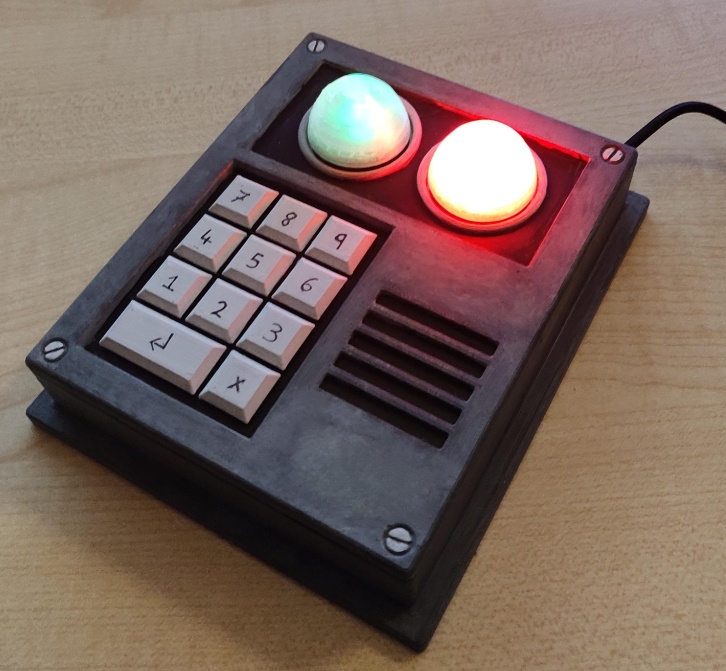

# Rust Code Lock Model Replica

A working model replica of the code lock from the game "Rust"

This item locks doors in the game. As a working replica I made the keypad buttons work as additional keyboard inputs over USB.

## Reference Images

Below are some screenshots that were used as a reference when 3D modelling the item

## 3D Model

The two coloured sections below are seperate pieces that can be printed without any support material. The keypad section is slightly oversized from the in-game model for ease of use.

## Electronics

This proto board lies below the top piece. All the buttons are connected to an Arduino on the bottom side which is programmed to act as a USB HID. All the keypad buttons work as keyboard inputs F13-F23. The dome lights are also buttons and both act as F24, also changing the current lighting state when pressed (mainly green/mainly red/completely off).

## Final Product

